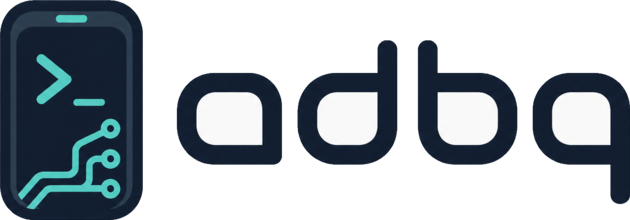

<p align="center">
  <picture>
    <source media="(prefers-color-scheme: dark)" srcset="docs/assets/logo-dark.png">
    
  </picture>
</p>

# adbq — ADB Yöneticisi

[](https://github.com/WhileEndless/adbq/releases)
[](https://github.com/WhileEndless/adbq/actions/workflows/ci.yml)
[](LICENSE)
[](#indirme)

**adbq**, günlük Android hata ayıklama işlerini — logcat, shell, uygulama
yönetimi, dosya aktarımı, port yönlendirme, frida-server, ağ/proxy kontrolü,
paket yakalama, iptables ve ekran görüntüsü — hızlı, klavye dostu,
Linear/Raycast tarzı bir arayüzde toplayan çapraz platform bir masaüstü ADB
yöneticisidir. [Wails v2](https://wails.io) (Go arka uç + React/TypeScript ön
yüz) ile geliştirilmiştir ve macOS, Windows ve Linux üzerinde küçük bir yerel
ikili (binary) olarak çalışır — neyin gerçekten denendiği, neyin yalnızca
derlendiği için [Platform durumu](#platform-durumu--gerçekte-ne-deneniyor)
bölümüne bakın.

> 🇬🇧 **English:** For the English version of this document see
> [README.md](README.md).

---

## İçindekiler

- [Özellikler](#özellikler)
- [İndirme](#indirme)
- [Gereksinimler](#gereksinimler)
- [Kaynaktan derleme](#kaynaktan-derleme)
- [Çapraz platform derlemeler](#çapraz-platform-derlemeler)
- [Kullanım notları ve sınırlamalar](#kullanım-notları-ve-sınırlamalar)
- [Sürümleme ve yayınlar](#sürümleme-ve-yayınlar)
- [Mimari](#mimari)
- [Geliştirme](#geliştirme)
- [Lisans](#lisans)

---

## Özellikler

- **Çoklu cihaz sekmeleri** — bağlı her cihaz kendi sekmesini alır; tek tıkla geçiş.
- **Genel bakış** — üretici, model, Android sürümü, SDK, build, çekirdek, ABI,
  IP, MAC, Wi-Fi SSID, root yöntemi (Magisk / userdebug / su), canlı batarya/RAM/CPU.
- **Logcat** — `adb logcat -v threadtime` canlı akış, uygulama bazlı PID filtresi
  (100+ paket için aranabilir seçici), seviye filtresi, vurgulamalı metin arama,
  `.txt` dışa aktarma. İşletim sistemine ait satırlar varsayılan olarak gizlidir
  (tek düğmeyle geri gelir) ve liste pencerelenmiş çizilir; böylece konuşkan bir
  cihaz ekranı çekirdek audit gürültüsüne boğmaz. Bir uygulama seçiliyken, o
  uygulamanın 10 saniye içinde yinelediği satırlar ilkine daraltılır — açılıp
  kapatılabilir, dışa aktarma da buna uyar. Yukarı kaydırınca otomatik takip
  devreden çıkar; en yeni satıra dönmek için altta bir düğme belirir.
- **Shell** — cihaz başına birden çok eşzamanlı etkileşimli oturum; root
  oturumları otomatik `su`.
- **Uygulamalar** — yükleme (dosya seçici), kaldırma, zorla durdurma, veri
  temizleme, başlatma, sonlandırma, canlı PID ile yeniden başlatma, APK dışa
  aktarma, dumpsys tabanlı detaylar + izin listesi, kullanıcı/sistem filtresi.
- **Dosyalar** — `ls -lAp` listeleme, yerel push/pull seçicileri, mkdir, silme;
  `su -c` ile root anahtarı. frida-server ikililerini tanır ve detay panelinden
  başlatabilir.
- **Yönlendirmeler** — hem `adb forward` hem `adb reverse` için listeleme,
  ekleme, kaldırma; tek tıkla hazır ayarlar (DevTools, frida, Metro, mitmproxy).
- **Frida** — uçtan uca host + cihaz akışı. Cihaz tarafı: `/data/local/tmp/`
  içinde `frida-server-*` tarar, çalışan PID'i tespit eder, yapılandırılabilir
  portta başlatır/durdurur, GitHub'dan doğrulanmış sürümleri tek tıkla kurar.
  Host tarafı ("Frida Manager"): cihaz sürümüyle eşlenik bir Python `frida`
  venv'i kurar (tek wheel, SHA256 doğrulamalı, çevrimdışı `pip`) veya kendi
  yorumlayıcını kullanır; CodeMirror editörlü script kütüphanesi; Frida CodeShare
  arama/içe aktarma; uygulama başına script bağlama; ve scriptlerinle uygulamayı
  spawn/attach edip `console.log`/`send()`/hataları canlı konsola akıtan tek tıkla
  **Start/Attach with Frida**. Konsol aranabilir ve türe göre süzülebilir
  (log / send / uyarı / hata / oturum olayları); eşleşmeler vurgulanır, yukarı
  kaydırınca auto-scroll devredilir, görünen satırlar metin olarak dışa aktarılır.
- **Ağ** — arayüzler, IPv4/MAC/ağ geçidi/DNS, Wi-Fi SSID, `settings put global
  http_proxy` ile genel HTTP proxy ayarlama/okuma/temizleme.
- **Paket yakalama** — uygulama içi canlı yakalama ve analiz (gopacket), cihazda
  çözümleme, tam katman detayı, Wireshark sözdizimli görüntüleme filtresi,
  bellek/disk sınırları, ekranlar arası kalıcılık, durdurduktan sonra kaydetme,
  cihaza `tcpdump` otomatik kurulumu.
- **iptables** — cihaz üzerinde güvenli geri-alma ile kural yönetimi.
- **Ekran görüntüsü** — `adb exec-out screencap -p` ile diske kaydetme ve
  kaydetme penceresi.
- **Tema** — açık, koyu ve sistem (`prefers-color-scheme` izler); vurgu paleti
  `localStorage`'da saklanır.

## İndirme

İşletim sisteminiz için hazır ikiliyi
**[Releases sayfasından](https://github.com/WhileEndless/adbq/releases)** indirin:

| İşletim Sistemi | Dosya | Çalıştırma |
|----|-------|-----|
| **macOS** (Apple Silicon + Intel) | `adbq-macos-universal.zip` | Aç → `adbq.app`'i Uygulamalar'a sürükle |
| **Windows** (x64) | `adbq-windows-amd64.zip` | Aç → `adbq.exe`'yi çalıştır |
| **Linux** (x64) | `adbq-linux-amd64.tar.gz` | `tar -xzf … && adbq/adbq` — ya da simgeli menü girdisi için `adbq/install.sh` |

Elinizdeki sürümü her an doğrulayın:

```bash
adbq --version      # ayrıca: -v veya `version`
```

> **macOS Gatekeeper:** derlemeler henüz imzalı/noter onaylı değil, bu yüzden ilk
> açılış engellenebilir. Uygulamaya sağ tık → **Aç**, ya da karantina bayrağını
> temizleyin: `xattr -cr /Applications/adbq.app`.
>
> **Linux çalışma zamanı bağımlılıkları:** WebKit GTK çalışma zamanı yoksa
> kurun — örn. `sudo apt install libgtk-3-0 libwebkit2gtk-4.0-37`.

### Platform durumu — gerçekte ne deneniyor

| Platform | Durum |
|---|---|
| **macOS** | Burada geliştiriliyor ve kullanılıyor. Bu belgedeki her şey macOS'ta çalıştırılıyor. |
| **Linux** | CI'da derleniyor ve platform yolları bağlı (`~/Android/Sdk`, Java için `/usr/lib/jvm`, `xdg-open`, scrcpy, kurulabilir masaüstü girdisi). Yazar tarafından rutin olarak çalıştırılmıyor; "çalışması beklenir" deyin, "doğrulandı" demeyin. İkili **WebKit GTK 4.0**'a bağlanıyor — yalnızca 4.1 gönderen dağıtımlarda (Ubuntu 24.04+, Fedora 40+) 4.0 çalışma zamanı kurulmadıkça uygulama açılmaz. |
| **Windows** | CI'da derleniyor ve host entegrasyonlarının çoğu var (`.bat`/`.exe` araç adları, `%LOCALAPPDATA%` SDK kökü, WebView2, Explorer'da gösterme). **Yazar tarafından test edilmedi ve etkileşimli Shell ekranı çalışmıyor**: sözde terminal (PTY) gerekiyor, adbq bunu Windows'ta uygulamadı. Geri kalanı — logcat, uygulamalar, dosyalar, forward'lar, ağ, capture — için bilinen bir Windows engeli yok; ama "bilinen engel yok", "denendi" ile aynı şey değil. |

Linux ya da Windows'ta çalıştırırsan, neyin bozulduğunu (ya da hiçbir şeyin
bozulmadığını) yazan bir issue gerçekten işe yarar.

## Gereksinimler

adbq'yu **çalıştırmak** için yalnızca Android Platform Tools gerekir:

- `adb` ikilisinin `PATH`'te olması (ya da `$ANDROID_HOME/platform-tools`,
  Homebrew `platform-tools` cask'i veya varsayılan Android SDK konumu altında).

**Kaynaktan derlemek** için ek olarak:

- **Go 1.23+**
- **Node.js 18+** (20+ önerilir)
- **Wails v2 CLI**: `go install github.com/wailsapp/wails/v2/cmd/wails@v2.12.0`
- `wails doctor`'ın sağlıklı raporladığı platform araç zinciri:
  - **macOS:** Xcode komut satırı araçları
  - **Windows:** WebView2 çalışma zamanı (Windows 10/11'de yerleşik) + bir C derleyici (MinGW veya MSVC)
  - **Linux:** `gcc`, `libgtk-3-dev`, `libwebkit2gtk-4.0-dev`

## Kaynaktan derleme

```bash
git clone https://github.com/WhileEndless/adbq.git
cd adbq

wails doctor          # önce araç zincirini doğrula
make build            # → build/bin/  (veya: wails build)
make run              # derle, ardından çalıştır
```

Sık kullanılan Makefile hedefleri (argümansız `make` hepsini listeler):

| Hedef | Ne yapar |
|--------|--------------|
| `make dev` | Hot-reload geliştirme modu (Vite + Go) |
| `make build` | **Kendi sisteminiz** için `build/bin/` altına derler |
| `make build-prod` | Sembolleri çıkarılmış, `-trimpath`, sürüm damgalı yayın derlemesi |
| `make build-mac` / `build-mac-intel` / `build-mac-arm` | macOS universal / Intel (x86_64) / Apple Silicon — herhangi biri her Mac'te çalışır |
| `make build-universal` | macOS universal2 (arm64 + amd64), yalnızca macOS |
| `make build-linux` / `make build-windows` | O işletim sisteminde yerel derleme |
| `make build-target PLATFORM=os/arch` | İstediğiniz hedefi doğrudan derleyin, örn. `PLATFORM=darwin/amd64` |
| `make test` | Go testleri + ön yüz tip kontrolü |
| `make lint` | gofmt, go vet, staticcheck (kuruluysa), tsc |
| `make version` | Sürümü yazdırır (tek doğru kaynak) |
| `make doctor` | `wails doctor` |

## Çapraz platform derlemeler

Wails uygulamaları her işletim sistemi için yerel bir webview gömer (macOS/Linux'ta
WebKit, Windows'ta WebView2) ve CGO kullanır; bu yüzden **bir ikili, hedeflediği
işletim sisteminde derlenmelidir** — tek bir makineden macOS `.app`, Windows
`.exe` ve Linux ELF dosyasını güvenilir şekilde çapraz derleyemezsiniz.

Ancak **aynı işletim sisteminin farklı mimarileri** yerel olarak çapraz
derlenebilir — örn. Apple Silicon bir Mac'te `make build-mac-intel` (veya
`make build-target PLATFORM=darwin/amd64`) ile Intel/x86_64 derlemesi,
`make build-mac` ile de universal bir `.app` üretebilirsiniz.
`make build-target PLATFORM=os/arch`, zorlamak istediğiniz her hedef için genel
bir çıkış kapısıdır.

İşletim sistemleri arası dağıtım için adbq, her hedefi kendi yerel runner'ında
derleyip çıktıları yayınlayan bir **GitHub Actions matrisi** kullanır:

- **[`.github/workflows/ci.yml`](.github/workflows/ci.yml)** — her push/PR'da
  macOS + Windows + Linux üzerinde derler ve vet/gofmt/test çalıştırır. Bu,
  uygulamanın her yerde derlendiğinin kanıtıdır.
- **[`.github/workflows/release.yml`](.github/workflows/release.yml)** — push
  edilen bir `v*` etiketinde her üçünü derler, ardından bir GitHub Release
  oluşturup `adbq-macos-universal.zip`, `adbq-windows-amd64.zip` ve
  `adbq-linux-amd64.tar.gz` dosyalarını yükler.

Yani tüm platformlar için ikili yayınlamak üzere üç makineye ihtiyacınız yok —
sadece bir etiket push edin (aşağıya bakın), gerisini CI halletsin.

## Kullanım notları ve sınırlamalar

Bazı özellikler cihaz durumuna bağlıdır ve arayüzde açıkça belirtilir:

- **`frida-server` başlatma** root gerektirir; root'suz cihazlarda ekran
  sınırlamayı açıklar (bunun yerine yeniden paketleme ile `frida-gadget` kullanın).
- **Root anahtarları** (Dosyalar / yakalama / iptables) `su`'nun shell
  kullanıcısının `PATH`'inde olmasına dayanır (Magisk standardı). Hatalar toast
  ile bildirilir.
- **`http_proxy`** yalnızca sistem HTTP yığınını etkiler; kendi istemcisini
  getiren uygulamalar (TLS pinning, özel DNS) bunu yok sayar.
- **Paket yakalama / tcpdump** kurulumu cihaza sabitlenmiş bir
  `magisk-tcpdump` derlemesi indirir; yalnızca root'lu cihazlar.
- **Pano (clipboard)** bilinçli olarak sunulmaz: Android 10+ arka planda pano
  okumayı engeller.

## Sürümleme ve yayınlar

Sürüm **tek bir yerde** tutulur:
[`internal/version/version.go`](internal/version/version.go). Arayüz
(`App.Version` binding'i), `adbq --version` CLI bayrağı ve yayınlanan git etiketi
hepsi buradan okur; CI ise **push edilen etiket bu dosyayla eşleşmezse yayını
başarısız sayar** — böylece asla birbirinden ayrı düşemez.

adbq, `v` öneki ile [Anlamsal Sürümleme](https://semver.org/lang/tr/)'yi izler;
mevcut hat bir **beta**'dır (`v0.1.0-beta`). 1.0 öncesi olması, arayüz ve
binding'lerin minör sürümler arasında değişebileceği anlamına gelir.

Bir sürüm çıkarmak:

```bash
# 1. internal/version/version.go içindeki değeri yükselt (örn. v0.2.0)
# 2. commit'le
git commit -am "release: v0.2.0"
# 3. AYNI değerle etiketle ve push et
git tag -a v0.2.0 -m "v0.2.0"
git push origin main --tags
# → release.yml üç işletim sistemini de derler ve GitHub Release'i yayınlar
```

## Mimari

```
adbq/
├── app.go                  # Wails binding'leri: internal/adb üzerinde ince katman
├── app_invalidate.go       # mutasyon yapan binding'lerin önbellek domain beyanı
├── device_watcher.go       # cihaz listesini yayınlar (push, poll yedekli)
├── main.go                 # Wails önyükleme + `--version` bayrağı
├── internal/
│   ├── version/            # sürüm için tek doğru kaynak
│   └── adb/
│       ├── adb.go          # Client (ikili arama, exec, su sarmalama)
│       ├── metrics.go      # adb süreç sayaçları (Settings → adb load)
│       ├── track.go        # host:track-devices — cihaz listesi push, poll yok
│       ├── cachedomain.go  # önbellek domain'leri + invalidation (CLAUDE.md §4.2)
│       ├── capabilities.go # cihaz başına sabit olan her şey, tek batch sorgu
│       ├── packetring.go   # canlı capture'ın sabit bellekli ring'i
│       ├── devices.go      # adb devices, getprop, root tespiti
│       ├── logcat.go       # akışlı logcat (events)
│       ├── shell.go        # etkileşimli shell oturumları
│       ├── apps.go         # pm list / dumpsys / install / uninstall / pull
│       ├── files.go        # ls -lAp ayrıştırıcı, push/pull/mkdir/rm
│       ├── forwards.go     # forward/reverse CRUD
│       ├── frida.go        # /data/local/tmp tarama + setsid+su başlatma
│       ├── network.go      # ip addr, dumpsys wifi, http_proxy
│       ├── iptables.go     # cihaz üzerinde kural yönetimi + geri alma
│       ├── tcpdump.go      # sabitlenmiş magisk-tcpdump otomatik kurulumu
│       ├── screenshot.go   # exec-out screencap -p
│       └── stats.go        # /proc/meminfo, /proc/loadavg, dumpsys battery
├── frontend/src/
│   ├── App.tsx             # kabuk (başlık çubuğu, cihaz sekmeleri, kenar çubuğu)
│   ├── ui.tsx              # tema hook'u, toast'lar, modallar, arama
│   ├── cache.tsx           # tek istemci önbelleği; anahtarlar domain taşır
│   ├── lib/poll.ts         # görünürlüğe ve değişebilirliğe kapılı poll
│   ├── icons.tsx          # satır içi SVG seti
│   └── screens/            # ekran başına bir dosya, Wails events ile canlı bağlı
├── .github/workflows/      # ci.yml (her yerde derle) + release.yml (yayınla)
└── design-reference/       # özgün tasarım devir dosyaları (derlenmez)
```

Tüm dışa açık `App` metotları `wails generate module` ile otomatik bağlanır ve
tip güvenlidir.

## Geliştirme

```bash
make dev               # hot-reload (Vite + Go)
make test              # Go testleri + ön yüz tip kontrolü
make lint              # gofmt, go vet, staticcheck, tsc
```

Go arka ucu hem birim testleri (saf ayrıştırıcılar, cihaz gerektirmez) hem de
ilk çevrimiçi ADB cihazına bağlanan entegrasyon testleri içerir:

```bash
go test ./...                          # birim + entegrasyon
ADBQ_SKIP_DEVICE=1 go test ./...       # cihaza dokunan testleri atla
```

Katkılar `make lint`, `make test` ve `wails doctor`'ı yeşil tutmalıdır — tüm
proje kuralları için [`CLAUDE.md`](CLAUDE.md) ve [`docs/`](docs/) dizinine bakın.

## Lisans

[MIT Lisansı](LICENSE) altında yayınlanmıştır. © 2026 WhileEndless.
